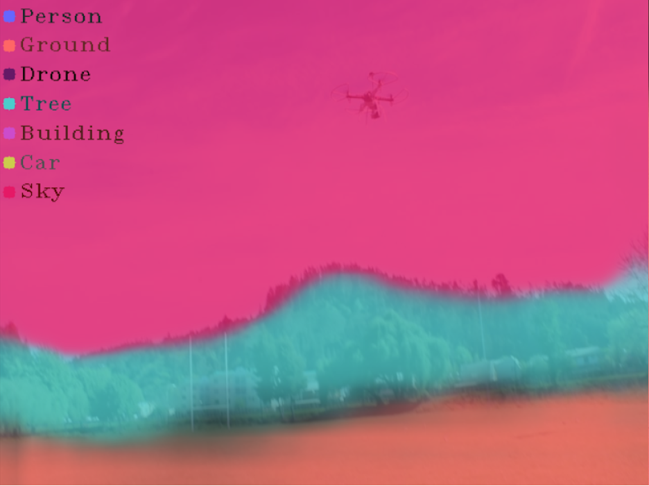
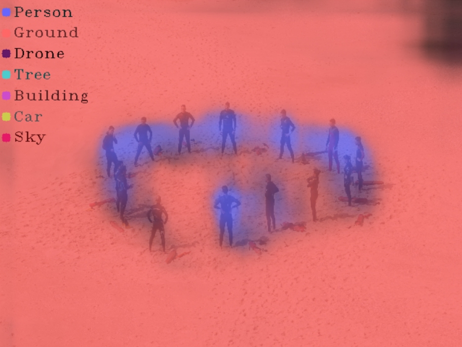
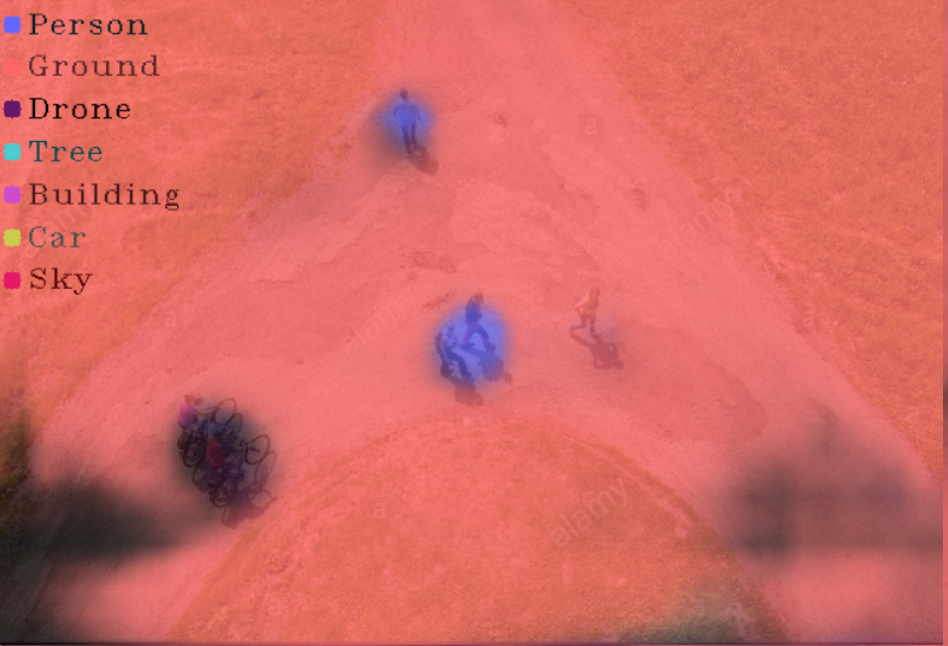
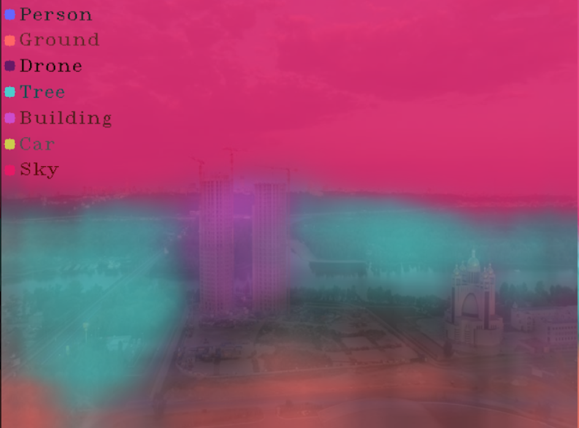
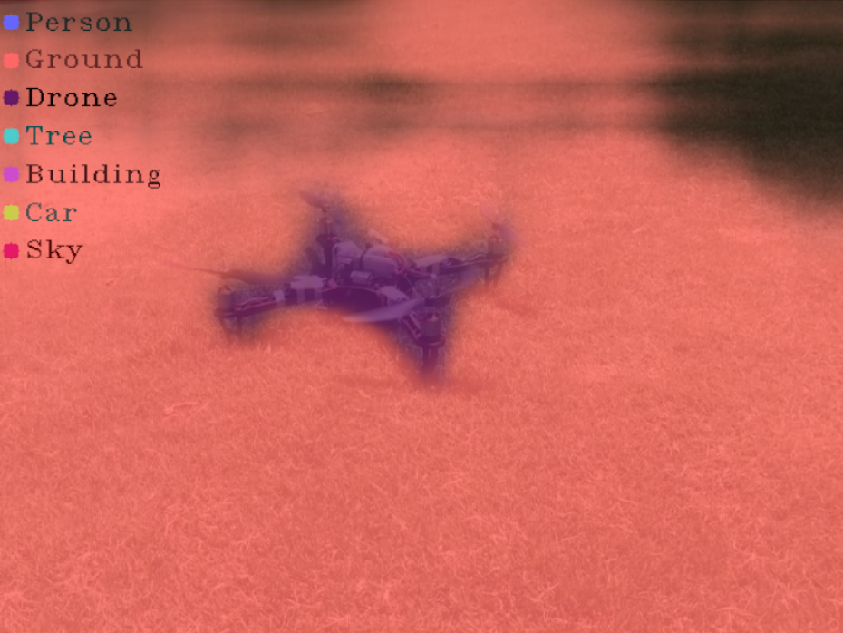
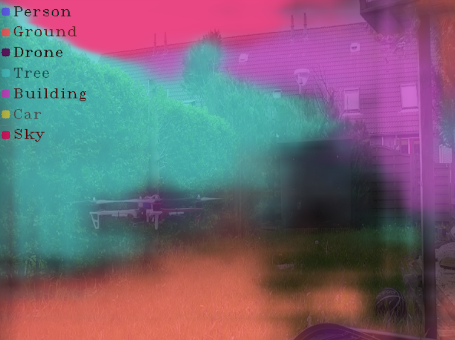

# FCN

**Fully Convolutional Network for Semantic Segmentation**

FCNs can produce pixel labels on input images to create masks for objects. This implementation can be trained on an arbitrary number of classes with user-given data. Classic FCN models like VGG16 and ResNet are built in, but custom models may also be used instead. Image preprocessing (zoom, rotation, shift, flip, shear) can be applied to the training data to artificially increase the amount of training data, and prevent overfitting.


</img> 
</img> 
</img> 
</img> 
</img> 
</img> 

**Training**
```python
from fcn import *

classifier = FCN(model='Vgg16',classes=8,input_shape=(224,224,3))

classifier.train('train/img', 'train/label', epochs=100, val_split=0.1, # Learning parameters
                  zoom=0.5, rotation=180, shear=0.3, colorshift=0.3)    # Preprocessing
```

**Evaluation**
```python
from imgstream import Stream
from fcn import *

# Initialize FCN Classifier
classifier = FCN(model='Vgg16',classes=8,input_shape=(224,224,3))

# Create a Stream object to get images in an iterator
stream = Stream(mode='img',src='test')

for img in stream:

  # Predict
  mask = classifier.predict(img)
  
  # Overlay prediction confidence mask on image for visualization
  labels = ['Nothing','Person','Ground','Drone','Tree','Building','Car','Sky']
  confidence = Stream.mask(mask[:,:,1:], img, alpha=0.2, argmax=False, labels=labels[1:])
  
  # Show masked image
  Stream.show(confidence,"Confidence",pause=False,shape=(shape[:2]))
```
